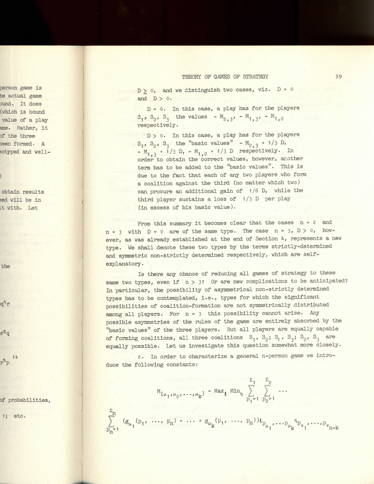
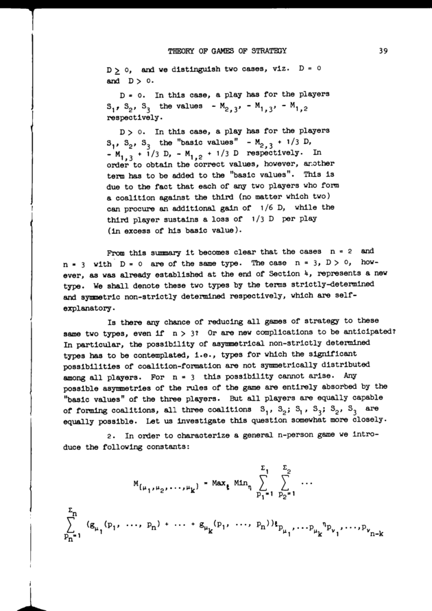
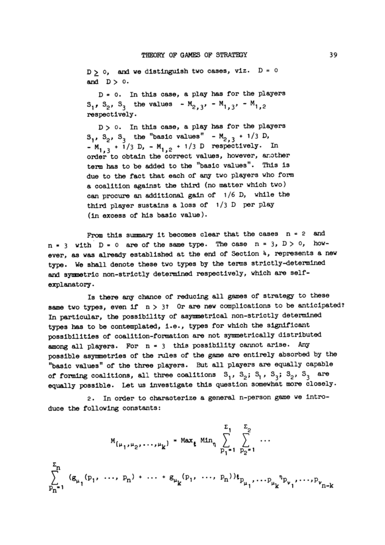

# Digitization of a scanned paper

A reproducible demonstration of my digitization workflow on a book requires uploading the raw scanned images, which is impractical. I will instead use as an example a paper of von Neumann taken from [here](https://cs.uwaterloo.ca/~y328yu/classics/vonNeumann.pdf). It is already a compiled PDF file, but it is not digitized in the usual sense --- it is simply a sequence of colored images. There is no attempt to remove visual artifacts, no outline, no text layer. This makes it a good candidate for demonstrating my digitization workflow. Roughly, we transform [this file](<./vonNeumann.pdf>) into [this file](<./John von Neumann - On the Theory of Games of Strategy.pdf>).

## Workflow

The preliminary work of scanning is more-or-less obvious. The processing work is done in a series of steps, each handled by different tools.

The orchestrator for the work is [GNU Make](https://www.gnu.org/software/make/). Roughly, a command like `make -j 8` will leave 8 workers to do all the heavy work concurrently, with a possibility of intervening at any point. The [Makefile](./Makefile) has detailed comments on every aspect of the workflow.

Other auxiliary programs are of course necessary. The ones listed below have been most beneficial in general:

* [ImageMagick](https://imagemagick.org/) for general-purpose image processing.
* [unpaper](https://github.com/unpaper/unpaper) for post-processing scanned pages.
* [Tesseract OCR](https://github.com/tesseract-ocr/tesseract) for OCR.
* [OCRmyPDF](https://github.com/ocrmypdf/OCRmyPDF) for performing OCR on an existing PDF file via the above tool.
* [Ghostscript](https://www.ghostscript.com/) for processing PDF files.
* [pdftk](https://www.pdflabs.com/tools/pdftk-the-pdf-toolkit/) for some common PDF operations.
* [djvulibre](https://github.com/traycold/djvulibre) for working with DjVu files.
* [dpsprep](https://github.com/kcroker/dpsprep) for converting DjVu to PDF.

### Working directories

There is a "source directory" and a "temporary working directory".

The name of the source directory is used as follows:
* It is used as a name in the metadata of the PDF document.
* It is also used for the output file name ([`John von Neumann - On the Theory of Games of Strategy.pdf`](<./John von Neumann - On the Theory of Games of Strategy.pdf>)).
* Its hash is used for the path for the temporary directory (`/var/tmp/digitization/1e352581`).

The files in the temporary directory are preserved so that we do not have to start over if something is off in the result. The intermediate files can be removed via `make clean-tmp`.

### Starting point

We start with a directory scanned images. Our case is a bit pathological since we extract the images from a source PDF file.

The above image is used only for demonstration. In the actual process, we use `pdftoppm` to extract a grayscale image directly.

### Image processing

Images must be processed. This is usually done through ImageMagick operations. The concrete operations are commented in the Makefile in detail. The gist is that we take a colorful or grayscale image and do our best to produce a bitonal image. It is important that the resulting images are bitonal --- they look most closely to what digital typesetting would produce, and they are the only pixel format that PDF allows compressing well.

### Unpapering

An immensely useful step is running the above image through `unpaper`, which cleans up various visual artifacts and does some page realignment.

### Combining the images

Once all pages are processed individually, we combine them into a single large PDF file using ImageMagick. At this step we also adjust the DPI that the resulting PDF file must have. There are no visual changes from this point on.

We avoid compression here because it will be done later by OCRmyPDF, but it is important that we have done our best to produce images that _can_ be compressed efficiently using [group4](https://en.wikipedia.org/wiki/Group_4_compression) or [jbig2](https://en.wikipedia.org/wiki/JBIG2). Non-bitonal PDF image files cannot be compressed efficiently, leading to files that are hundreds of megabytes large.

> [!NOTE]
> [DjVu](http://yann.lecun.com/ex/djvu/index.html) does miracles for both text layers and compression, making it more convenient than PDF. It is unfortunately more-or-less a dead file format at this point and tools for working with it are in maintenance mode at best.
> I used to build DjVu files, but I learned that it's better to provide a PDF myself than to let people use bad converters.

### OCR

At this point we have a PDF file with nice readable text, but the text only exists as an image. It cannot be searched nor copied.

The primary role of OCRmyPDF is to pass the images through OCR software like Tesseract. It also does a great job at compressing the source files --- I've had it compress the files by 92% (although, as mentioned above, the images were preprocessed as to allow such compression).

### Outline

The final step of the build process is to add the so-called outline --- mostly bookmarks and page index translation. The bookmarks are obvious. Page index translations less so, but they are born out of necessity; for example, the first page in the PDF file is numbered "13", and we want the PDF metadata to reflect that.

We use pdftk for adding this metadata. See the [./outline.txt](./outline.txt) file.
